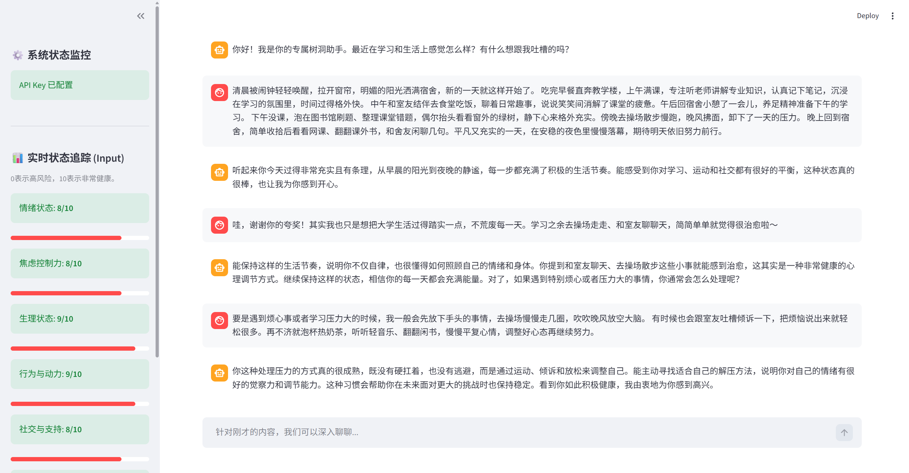



  

<h1 align="center">心聆 Echo — AI 心理陪伴与状态感知助手</h1>

  <strong>三个心理空间 · 六维状态画像 · 多模态感知 · 长程记忆 · 安全边界</strong>

---

## 🌟 项目简介

**心聆 Echo** 是一款基于 **Streamlit** 构建的 AI 心理陪伴应用，融合了**大语言模型（DeepSeek / Qwen）**、**多模态感知（语音 / 表情 / TTS）**、**RAG 知识检索**与**长程记忆**能力。

| 空间 | 定位 | 核心能力 |
|------|------|----------|
| 🔽 **踩下心情** | 日记与自我觉察 | 六维状态评估、雷达图画像、智能评语、周月报告 |
| 🌳 **秘密树洞** | 匿名情绪释放 | 语音输入、表情识别、AI 共情回复 |
| 🌍 **另一个世界** | 长期 AI 伴侣 | 长程记忆、亲密度成长、关系阶段演进、主动关怀 |

> ⚠️ **Echo 是心理陪伴与状态感知工具，不是医疗诊断或应急系统。** 详情请参阅 [SAFETY.md](./SAFETY.md)。

---

## ✨ 核心功能

### 🧠 AI 对话引擎（双模式）
- **DeepSeek 云端模式**：API 调用，支持复杂对话与深度共情
- **Qwen 本地模式**：基于 Qwen + LoRA 微调模型本地运行，完全离线
- **模式自动切换**：TREEHOLE_REPLY_PROVIDER=auto 优先云端，降级到本地
- **六维心理评估提示词体系**：情绪、焦虑、生理、行为、社交、认知

### 🎭 多模态感知系统
| 模态 | 能力 | 依赖 |
|------|------|------|
| 🎤 语音输入 | 实时语音转文字，文件上传 | QWEN_API_KEY 或本地麦克风 |
| 🎧 TTS 语音回复 | AI 回复语音播报 | QWEN_API_KEY |
| 📷 表情识别 | 摄像头实时面部表情分析 | OpenCV + QWEN_API_KEY |
| 📝 文字输入 | 基础文本 | 无 |

### 📊 六维心理状态评估
从日记/对话自动提取六个维度健康评分（0-100）：

| 维度 | 代码 | 评估内容 | 关键词示例 |
|------|------|----------|------------|
| 情绪状态 | x1 | 情绪稳定性 | 开心、低落、麻木、崩溃 |
| 焦虑与压力 | x2 | 焦虑水平 | 焦虑、紧张、担心、惊恐 |
| 生理状态 | x3 | 睡眠、饮食、躯体 | 失眠、头痛、疲惫、心悸 |
| 行为与动力 | x4 | 行动力、拖延 | 拖延、不想动、坚持、计划 |
| 社交与支持 | x5 | 社会支持感 | 朋友、孤独、倾诉、冲突 |
| 认知与意义 | x6 | 自我价值感 | 迷茫、自责、希望、意义 |

- 雷达图可视化 · 综合评分 · 周报/月报趋势追踪

### 🔐 隐私与安全
- **本地离线模式**：不配置 API Key 即可运行，数据仅存 data/
- **云端可选**：Supabase 同步需用户授权
- **安全边界**：三级风险分级，高风险仅前台建议，**不后台上报**

### 🧩 RAG 知识检索
LangChain + ChromaDB + FAISS，嵌入模型 BAAI/bge-small-zh-v1.5

### 🎯 Qwen 微调
LoRA 微调脚本 inetune_qwen.py，数据准备 data/prepare_finetune_data.py

### 🔔 主动推送引擎
三通道定时关怀（陪伴 6h / 树洞 8h / 测评 12h），可配频率和免打扰时段

---

## 🏗 项目架构

`
├── main.py                     # 入口（Streamlit 路由）
├── ui/                         # 前端页面
│   ├── home_page.py            # 首页（三个空间入口）
│   ├── diary_chat_page.py      # 踩下心情——日记与心理评估
│   ├── treehole_page.py        # 秘密树洞
│   ├── companion_page.py       # 另一个世界——AI 伴侣
│   ├── profile_page.py         # 个人资料
│   ├── multimodal_controls.py  # 多模态控制组件
│   ├── crisis_alert.py         # 危机预警 UI
│   └── sidebar.py              # 侧边栏
├── services/                   # 核心服务层
│   ├── ai_service.py           # DeepSeek AI 对话
│   ├── local_ai.py             # 本地规则引擎 + Qwen
│   ├── local_model_service.py  # 本地模型管理
│   ├── multimodal_service.py   # 语音/表情服务
│   ├── psych_assessment.py     # 六维心理评估引擎
│   ├── treehole_ai_service.py  # 树洞 AI 回复
│   ├── app_storage.py          # 运行时状态与存储路由
│   ├── storage_auth.py         # 登录认证
│   ├── storage_cloud.py        # Supabase 云同步
│   ├── storage_local.py        # 本地 JSON 存储
│   ├── user_profile.py         # 用户画像管理
│   ├── message_format.py       # 消息格式化
│   ├── rag_service.py          # RAG 检索（ChromaDB）
│   ├── proactive_engine.py     # 主动推送引擎
│   └── safety.py               # 安全边界检查
├── data/                       # 本地数据
│   ├── diary_ui/               # 日记数据
│   ├── companion/              # 伴侣数据
│   └── treehole/               # 树洞数据
├── tests/                      # 测试用例
├── tools/                      # 辅助工具
├── scripts/                    # 项目脚本
├── inducing/                   # RAG 知识库构建
├── Multimodal/                 # 多模态配置
├── requirements.txt            # 依赖清单
├── setup_guide.md              # 安装指南
└── SAFETY.md                   # 安全说明
`

---

## 🚀 快速开始

### 环境要求
Python 3.10+，Windows/macOS/Linux，摄像头/麦克风（可选）

### 安装
`powershell
git clone https://github.com/SWT-0407/AI_psychology-Echo.git
cd AI_psychology-Echo
python -m venv .venv
.\.venv\Scripts\activate
pip install -r requirements.txt
copy .env.example .env    # 编辑 .env 按需配置
streamlit run main.py     # 启动
`

### .env 配置
| 变量 | 用途 | 必填 |
|------|------|------|
| DEEPSEEK_API_KEY | DeepSeek 对话模型 | ❌ |
| QWEN_API_KEY | 语音/表情/TTS | ❌ |
| TREEHOLE_REPLY_PROVIDER | 树洞回复来源 | ❌ |
| LOCAL_LORA_PATH | 本地微调模型路径 | ❌ |
| SUPABASE_URL/KEY | 云同步 | ❌ |

> 首次进入选择 **「跳过 → 本地使用」** 即可。

---

## 🧩 UI 页面

| 页面 | 说明 |
|------|------|
| 🏠 首页 | 三个空间入口，主动推送消息 |
| 📝 踩下心情 | 日历视图、写日记、六维雷达图、周月报 |
| 🌳 秘密树洞 | 匿名聊天、语音/表情输入、AI 共情回复 |
| 🌍 另一个世界 | 微信风格气泡、角色创建、长程记忆、亲密度系统 |
| 👤 个人资料 | 信息编辑、画像概览、云同步设置 |

---

## 📦 服务层

### AI 评估算法
1. 关键词匹配→信号强度（-1.15~+0.9）→基线（6.0-7.0）调整→覆盖度修正→加权汇总
2. 权重：x1=0.20, x2=0.18, x3=0.14, x4=0.16, x5=0.12, x6=0.20

### 用户画像
六维信号追踪，指数衰减（半衰期 7 天），事件上限 80 条，自动话题挖掘与标签

### 安全边界
三级风险分级，危机关键词库，高风险仅前台展示建议

### 数据存储
本地 JSON（零配置）或 Supabase 云同步（需授权）

---

## 🧪 测试
`powershell
pytest tests/ -v
`

## 🔧 可选功能
- **云同步**：Supabase 建表后配置 .env
- **多模态**：需 QWEN_API_KEY + OpenCV
- **RAG**：python inducing/rebuild_all_books.py
- **微调**：python data/prepare_finetune_data.py && python finetune_qwen.py

---

## 📋 依赖
streamlit==1.57.0 python-dotenv==1.2.2 openai==2.36.0 supabase==2.30.0 
umpy==2.4.4 pandas==3.0.2 matplotlib==3.10.9 opencv-python==4.13.0.92 SpeechRecognition==3.16.1 pyttsx3==2.99 PyAudio==0.2.14 langchain-community==0.4.1 langchain-huggingface==1.2.2 langchain-chroma==1.1.0 aiss-cpu==1.13.2 sentence-transformers==5.4.1

---

## 📄 许可
仅供学习和研究使用。

  <strong>心聆 Echo — 听见你的每一次心动</strong>
   
  用 AI 温暖陪伴，让情绪被看见

